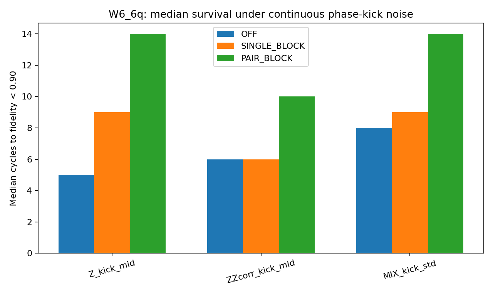
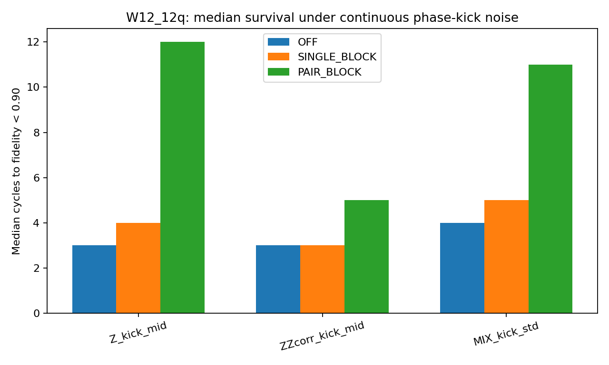
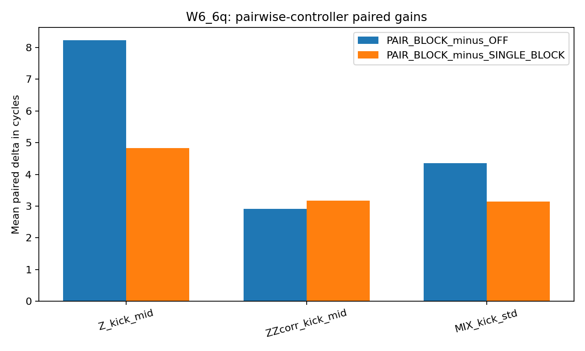
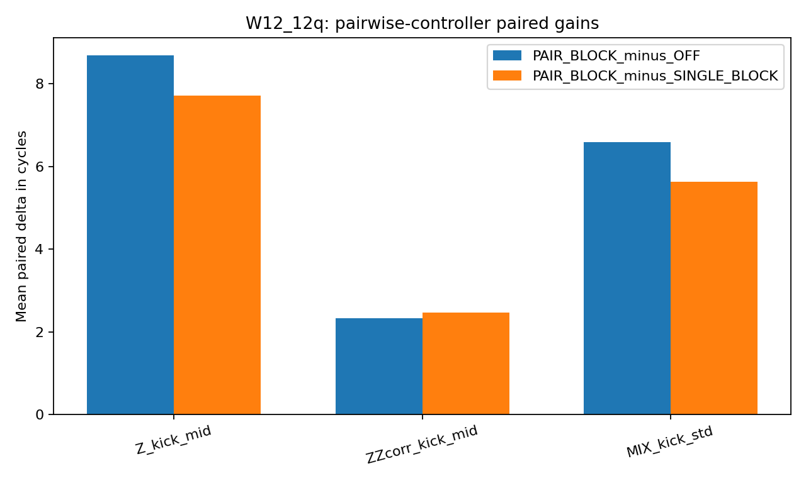

**Affiliation:** Independent Artist and Independent Researcher

## Abstract

This paper documents a repeated-seed statevector simulation study of measurement-limited feedback control under continuous phase-kick noise. Two nearest-neighbor chain workloads were evaluated: a 6-qubit chain and a 12-qubit chain. Three controller modes were compared: no correction (OFF), a controller using only single-qubit summaries (SINGLE_BLOCK), and a controller using single-qubit plus nearest-neighbor pairwise summaries (PAIR_BLOCK). Physical noise schedules were matched across controller modes on a per-seed basis, and measurement randomness used a separate random-number stream so that controller operation could not alter the underlying noise sequence. The primary endpoint was cycles-to-threshold, defined as the first cycle at which fidelity to the ideal noiseless trajectory fell below 0.90.

The study was designed to answer a narrow question: when phase drift includes nearest-neighbor structure, do nearest-neighbor pairwise summaries expose control-relevant information that is not available from single-qubit summaries alone? In the preserved simulation outputs analyzed here, PAIR_BLOCK produced longer median cycles-to-threshold than OFF and SINGLE_BLOCK across both workloads under independent continuous Z kicks and under mixed phase-kick noise. Under nearest-neighbor ZZ kicks, the advantage remained present but smaller. The paper reports the simulation design, observable algebra, statistical protocol, preserved results, and limits of interpretation. The scope of the result is restricted to the measurement-limited statevector simulation and the specific controller and noise models archived with the run artifacts.

## 1. Introduction

Measurement-based feedback is a standard tool in quantum control, and the literature on continuous quantum measurement and feedback provides the background for stabilizing phase-sensitive dynamics in noisy quantum systems [1,2]. Experimental demonstrations of real-time quantum feedback have shown that partial measurement records can be used to stabilize target behavior in both cavity and superconducting-qubit settings [3,4]. This paper stays within simulation, but it asks a closely related and more specific question: if local phase drift contains nearest-neighbor structure, what information must a controller observe in order to respond to that structure?

The emphasis here is explanatory rather than promotional. The objective is not to claim a new hardware protocol, a compiler advantage, or new physics. The objective is to describe what was actually tested in a preserved run archive, why the pairwise summaries are informative from the Pauli algebra, and what the saved outputs show under a tightly defined repeated-seed protocol.

## 2. Simulation design

### 2.1 Workloads

Two workloads were evaluated.

- **W6_6q:** a 6-qubit nearest-neighbor chain with edges $(1,2),(2,3),(3,4),(4,5),(5,6)$.
- **W12_12q:** a 12-qubit nearest-neighbor chain with edges $(1,2),\ldots,(11,12)$.

For each cycle $t$, the simulated state $|\psi_t\rangle$ was compared with an ideal noiseless reference state $|\psi_t^{\mathrm{ideal}}\rangle$ produced by running the same cycle schedule without noise. The saved artifacts preserve the run-level cycles-to-threshold values and final fidelity values, together with aggregate summaries and paired comparison tables.

### 2.2 Noise models

All noise was applied once per cycle.

**Independent Z kicks (Z\_kick\_mid)**

$$
\theta_i(t) \sim \mathcal{N}(0,\sigma_Z^2), \qquad \sigma_Z = 0.06 \; \mathrm{rad/cycle}.
$$

**Nearest-neighbor ZZ kicks (ZZcorr\_kick\_mid)**

$$
\theta_{ij}(t) \sim \mathcal{N}(0,\sigma_{ZZ}^2), \qquad \sigma_{ZZ} = 0.06 \; \mathrm{rad/cycle}
$$

for $(i,j)$ on chain edges.

**Mixed phase-kick noise (MIX\_kick\_std)**

- independent Z kicks with $\sigma_Z = 0.04$ rad/cycle,
- nearest-neighbor ZZ kicks with $\sigma_{ZZ} = 0.03$ rad/cycle,
- rare X flips with probability $p_X = 0.001$ per qubit per cycle.

The per-cycle noise unitary was

$$
U_{\mathrm{noise}}(t) =
\left[ \prod_i e^{-i\theta_i(t) Z_i / 2} \right]
\left[ \prod_{(i,j)} e^{-i\theta_{ij}(t) Z_i Z_j / 2} \right]
\left[ \prod_i X_i^{b_i(t)} \right],
$$

where $b_i(t) \sim \mathrm{Bernoulli}(p_X)$ in the mixed condition and $b_i(t)=0$ otherwise.

The final study used continuous phase-kick noise rather than discrete Pauli sign flips because the controller family tested here is based on phase summaries; a continuous kick model supplies an observable phase offset that such summaries can, in principle, sense.

### 2.3 Controller modes

Three controller modes were compared.

- **OFF:** no correction.
- **SINGLE_BLOCK:** measurement-limited feedback using only single-qubit $X_i$ and $Y_i$ summaries.
- **PAIR_BLOCK:** measurement-limited feedback using single-qubit summaries plus nearest-neighbor pairwise summaries derived from $Y_i Z_j$ and $Z_i Y_j$ correlators.

Both active controllers used proportional correction from summary residuals relative to the ideal target summaries preserved by the simulation protocol. The archived configuration specifies:

- control update interval: every 2 cycles,
- effective shot budget: 512 shots per required observable,
- Gaussian finite-shot approximation,
- local gain $g_{\mathrm{local}} = 1.0$,
- edge gain $g_{\mathrm{edge}} = 0.5$.

The finite-shot approximation was implemented as

$$
\hat{\mu} = \mu + \varepsilon, \qquad
\varepsilon \sim \mathcal{N}\left(0, \frac{1-\mu^2}{N}\right), \qquad N=512.
$$

Block localization was fixed as follows.

- W6\_6q: 3 blocks of 2 qubits.
- W12\_12q: 4 blocks of 3 qubits.

### 2.4 Matched-seed protocol and endpoint

For each seed $s$, all controller modes were run under the same physical noise schedule. Measurement randomness was generated from a separate random-number stream so that turning measurement or feedback on could not change the future physical noise sequence by consuming random draws in a different order. This separation matters, because coupled noise and measurement RNG streams can create spurious controller advantages.

The primary endpoint was **cycles-to-threshold**,

$$
t^* = \min \{ t : F_t < 0.90 \},
$$

where

$$
F_t = |\langle \psi_t^{\mathrm{ideal}} | \psi_t \rangle|^2
$$

is fidelity to the ideal noiseless trajectory at cycle $t$.

## 3. Observable algebra

The algebraic rationale for pairwise summaries is straightforward. Let

$$
U(\theta) = e^{-i\theta Z_i Z_j / 2}.
$$

Using the Pauli commutation relations,

$$
[Z_i, X_i] = 2iY_i,
$$

and therefore

$$
[Z_i Z_j, X_i] = Z_j[Z_i,X_i] = 2i Y_i Z_j,
$$

$$
[Z_i Z_j, X_j] = Z_i[Z_j,X_j] = 2i Z_i Y_j.
$$

Repeated commutators close on two-dimensional subspaces,

$$
[Z_i Z_j, Y_i Z_j] = -2i X_i,
$$

with an analogous closure for the $(X_j, Z_i Y_j)$ pair. Conjugation then yields

$$
U(\theta)^\dagger X_i U(\theta) = X_i \cos\theta + (Y_i Z_j) \sin\theta,
$$

$$
U(\theta)^\dagger X_j U(\theta) = X_j \cos\theta + (Z_i Y_j) \sin\theta.
$$

A nearest-neighbor $ZZ$ phase perturbation therefore rotates single-qubit $X$ components into pairwise $YZ$ and $ZY$ correlators. A controller restricted to single-qubit summaries cannot directly observe the full response generated by a $ZZ$ phase term. Pairwise summaries are informative because they expose the edge-phase component that single-qubit summaries alone leave partially hidden.

## 4. Statistical protocol

For each comparison and seed, a paired delta was formed,

$$
\Delta_s = t^*_{A,s} - t^*_{B,s}.
$$

The main analysis reports median cycles, mean cycles, interquartile range (IQR), and standard deviation for each controller mode and condition. For paired comparisons, the archived results report the paired median delta, paired mean delta, positive/negative/zero fractions across seeds, and a 95% percentile bootstrap confidence interval for the paired median delta using 5000 bootstrap resamples [5].

The main benchmark used 80 matched seeds. A separate sensitivity pass used 80 fresh system-entropy seeds for OFF and PAIR_BLOCK under the same workload and noise combinations.

## 5. Results

### 5.1 Descriptive summaries

**Table 1. W6\_6q descriptive statistics**

| Noise                     | Mode         |   Median cycles |   Mean cycles | IQR         |   SD |
|:--------------------------|:-------------|----------------:|--------------:|:------------|-----:|
| Mixed phase-kick noise    | OFF          |               8 |          8.2  | 6.75-9.25   | 2.77 |
| Mixed phase-kick noise    | PAIR_BLOCK   |              14 |         12.55 | 12.00-14.00 | 2.9  |
| Mixed phase-kick noise    | SINGLE_BLOCK |               9 |          9.4  | 7.00-12.00  | 2.86 |
| Nearest-neighbor ZZ kicks | OFF          |               6 |          6.72 | 4.75-8.00   | 3.11 |
| Nearest-neighbor ZZ kicks | PAIR_BLOCK   |              10 |          9.64 | 7.00-12.00  | 3.25 |
| Nearest-neighbor ZZ kicks | SINGLE_BLOCK |               6 |          6.46 | 4.75-8.00   | 2.67 |
| Independent Z kicks       | OFF          |               5 |          5.88 | 4.00-7.00   | 2.76 |
| Independent Z kicks       | PAIR_BLOCK   |              14 |         14.1  | 14.00-14.00 | 1.05 |
| Independent Z kicks       | SINGLE_BLOCK |               9 |          9.28 | 6.00-12.25  | 3.76 |

**Table 2. W12\_12q descriptive statistics**

| Noise                     | Mode         |   Median cycles |   Mean cycles | IQR         |   SD |
|:--------------------------|:-------------|----------------:|--------------:|:------------|-----:|
| Mixed phase-kick noise    | OFF          |               4 |          4.35 | 3.00-5.00   | 1.38 |
| Mixed phase-kick noise    | PAIR_BLOCK   |              11 |         10.94 | 10.75-12.00 | 2.18 |
| Mixed phase-kick noise    | SINGLE_BLOCK |               5 |          5.3  | 4.00-6.00   | 1.67 |
| Nearest-neighbor ZZ kicks | OFF          |               3 |          3.65 | 2.75-5.00   | 1.47 |
| Nearest-neighbor ZZ kicks | PAIR_BLOCK   |               5 |          5.99 | 4.00-8.00   | 2.74 |
| Nearest-neighbor ZZ kicks | SINGLE_BLOCK |               3 |          3.52 | 2.00-5.00   | 1.42 |
| Independent Z kicks       | OFF          |               3 |          3.21 | 2.00-4.00   | 1.21 |
| Independent Z kicks       | PAIR_BLOCK   |              12 |         11.9  | 12.00-13.00 | 2.48 |
| Independent Z kicks       | SINGLE_BLOCK |               4 |          4.19 | 3.00-5.00   | 1.74 |

### 5.2 Paired comparisons: PAIR\_BLOCK versus OFF

**Table 3. Paired comparisons for PAIR\_BLOCK minus OFF**

| Workload   | Noise                     |   Median delta |   Mean delta | 95% bootstrap CI   | Positive seeds   | Negative seeds   | Zero delta   |
|:-----------|:--------------------------|---------------:|-------------:|:-------------------|:-----------------|:-----------------|:-------------|
| W12_12q    | Mixed phase-kick noise    |            7   |         6.59 | 7 to 7             | 96.2%            | 0.0%             | 3.8%         |
| W12_12q    | Nearest-neighbor ZZ kicks |            1.5 |         2.34 | 1 to 2             | 78.8%            | 1.2%             | 20.0%        |
| W12_12q    | Independent Z kicks       |            9   |         8.69 | 9 to 9.5           | 97.5%            | 0.0%             | 2.5%         |
| W6_6q      | Mixed phase-kick noise    |            5   |         4.35 | 4 to 5.5           | 80.0%            | 6.2%             | 13.8%        |
| W6_6q      | Nearest-neighbor ZZ kicks |            3   |         2.91 | 1 to 4             | 71.2%            | 6.2%             | 22.5%        |
| W6_6q      | Independent Z kicks       |            9   |         8.22 | 8 to 9             | 97.5%            | 2.5%             | 0.0%         |

The pattern in the archived outputs is consistent across both workloads. Under independent Z kicks, PAIR_BLOCK outperformed OFF strongly in both the 6-qubit and 12-qubit chains. Under mixed phase-kick noise, PAIR_BLOCK again exceeded OFF in both workloads. Under nearest-neighbor ZZ kicks, the advantage remained present, but the paired median deltas and the positive-seed fractions were smaller than under independent Z kicks and mixed noise. SINGLE_BLOCK often improved on OFF, but its effect was smaller than PAIR_BLOCK across the main conditions recorded in the saved tables.

### 5.3 Figures

{width=90%}

{width=90%}

{width=90%}

{width=90%}

### 5.4 Sensitivity pass

The separate 80-seed sensitivity pass preserved the direction of the main OFF-versus-PAIR\_BLOCK median separation in every tested workload/noise combination. The preserved median values from the sensitivity file were:

- W6\_6q, Z\_kick\_mid: OFF 5, PAIR\_BLOCK 14.
- W6\_6q, ZZcorr\_kick\_mid: OFF 6, PAIR\_BLOCK 10.
- W6\_6q, MIX\_kick\_std: OFF 8, PAIR\_BLOCK 14.
- W12\_12q, Z\_kick\_mid: OFF 3, PAIR\_BLOCK 12.
- W12\_12q, ZZcorr\_kick\_mid: OFF 3, PAIR\_BLOCK 5.
- W12\_12q, MIX\_kick\_std: OFF 4.5, PAIR\_BLOCK 11.

This pass does not replace the main paired analysis, but it does show that the observed direction of effect did not reverse under a fresh set of seeds.

## 6. Interpretation

The saved simulation outputs support the following narrow reading.

1. In this measurement-limited statevector simulation, nearest-neighbor pairwise summaries were more informative for active control under continuous phase-kick noise than single-qubit summaries alone.
2. The difference was largest under independent continuous Z kicks, remained visible under mixed phase-kick noise, and was smaller under nearest-neighbor ZZ kicks.
3. The result is an observation about the simulation design that was run. It does not establish hardware performance, universal controller superiority, a compiler/runtime advantage, or a general statement about all noise models.

The value of the result lies in explanation: when the perturbation rotates local observables into edge observables, the edge observables contain control-relevant information. The pairwise controller had access to that information; the single-summary controller did not.

## 7. Limitations

This study has several important limits.

- It is a **statevector simulation**, not a hardware experiment.
- The controller is **measurement-limited**, but it is still **model-guided**, because it compares measured summaries with ideal target summaries.
- The released package reproduces **analysis from preserved run-level CSV files**. It does **not** reconstruct the full simulator source that originally generated those files.
- The noise model is a **continuous phase-kick model** with fixed Gaussian parameters and a low-rate X-flip component in the mixed condition. Results should not be extrapolated beyond those settings without rerunning the simulator.
- The archived bootstrap intervals are percentile intervals computed from the preserved paired deltas. They summarize the retained run set; they do not substitute for a fresh end-to-end rerun.

## 8. Reproducibility

The package accompanying this manuscript contains:

- run-level data (`pairwise_runs.csv`),
- aggregate summaries (`pairwise_summary.csv`),
- paired comparison tables (`pairwise_comparisons.csv`),
- entropy sensitivity summaries (`entropy_sensitivity.csv`),
- the preserved analysis script (`scripts/reproduce_analysis.py`),
- figure files used in this manuscript.

A reader can reproduce the tables and descriptive statistics reported here directly from the included CSV files. What cannot be reproduced from the archived package alone is the original simulator execution path that created the run files, because that source was not preserved with the artifact bundle.

## Acknowledgments

Drafting and formatting support for this manuscript were assisted by ChatGPT (OpenAI GPT-5.4 Thinking). The author reviewed and approved the final text.

## References

[1] H. M. Wiseman, "Quantum theory of continuous feedback," *Physical Review A* **49**, 2133-2150 (1994). DOI: 10.1103/PhysRevA.49.2133.

[2] H. M. Wiseman and G. J. Milburn, *Quantum Measurement and Control*. Cambridge University Press (2009).

[3] C. Sayrin, I. Dotsenko, X. Zhou, B. Peaudecerf, T. Rybarczyk, S. Gleyzes, P. Rouchon, M. Mirrahimi, H. Amini, M. Brune, J.-M. Raimond, and S. Haroche, "Real-time quantum feedback prepares and stabilizes photon number states," *Nature* **477**, 73-77 (2011). DOI: 10.1038/nature10376.

[4] R. Vijay, C. Macklin, D. H. Slichter, S. J. Weber, K. W. Murch, R. Naik, A. N. Korotkov, and I. Siddiqi, "Stabilizing Rabi oscillations in a superconducting qubit using quantum feedback," *Nature* **490**, 77-80 (2012). DOI: 10.1038/nature11505.

[5] B. Efron and R. J. Tibshirani, *An Introduction to the Bootstrap*. Chapman and Hall/CRC (1993).

[6] T. J. Evans, R. Harper, and S. T. Flammia, "Scalable Bayesian Hamiltonian Learning," arXiv:1912.07636 (2019).

## Appendix A. File inventory

- `data/pairwise_runs.csv`
- `data/pairwise_summary.csv`
- `data/pairwise_comparisons.csv`
- `data/entropy_sensitivity.csv`
- `paper/figures/W6_6q_median_bars.png`
- `paper/figures/W12_12q_median_bars.png`
- `paper/figures/W6_6q_pairwise_deltas.png`
- `paper/figures/W12_12q_pairwise_deltas.png`
- `scripts/reproduce_analysis.py`

## Appendix B. Minimal reproduction workflow

1. Create a Python environment with `pandas` and `numpy`.
2. Run `python scripts/reproduce_analysis.py`.
3. Verify that the regenerated aggregate tables match the CSV summaries in `data/`.
4. Review the figures in `paper/figures/` against the table values.

